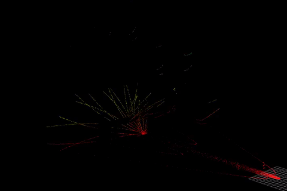
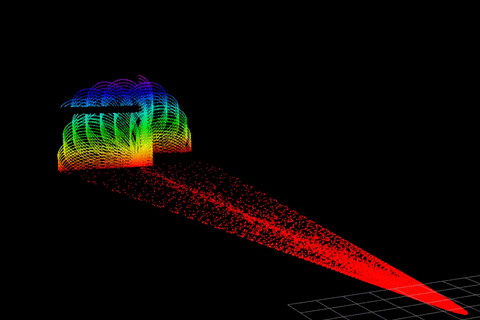

# Livox_simulation_customMsg
Livox simulation for Ubuntu18 and Gazebo 9, and can export 3 Ros messages: PointCloud, PointCloud2 and CustomMsg, they can be used in A-LOAM, Fast-LIO and so on.

### Refer to https://github.com/lvfengchi/livox_laser_simulation

# Some tips

You can change the msg by change the pointcloudType in `src/livox_points_plugin.cpp` line 101

You are also allowed to change the type of lidar in `src/livox_points_plugin.cpp` line 54. If you want to use `.xacro` model file, just skip this step, while using `.sdf`, please config the path of csv file.

# Livox Laser Simulation

A package to provide plug-in for [Livox Series LiDAR](https://www.livoxtech.com).

## Requirements
- ROS(=Melodic)
- Gazebo (= 9.x, http://gazebosim.org/)
- Ubuntu(=18.04)

## Results
- avia


- mid40


- mid70


- tele


- horizon


## Usage

> Note that the version of gazebo in main branch is gazebo 9.18. If you use gazebo 7, checkout to "gazebo7" branch.

Before you write your urdf file by using this plugin, catkin_make/catkin build is needed.

A simple demo is shown in livox_simulation.launch

Run 
```
    roslaunch livox_laser_simulation livox_simulation.launch
```
to see.

We can choose the lidar model by selecting different CSV file in scan_mode dir from changing the launch file:
- avia.csv
- horizon.csv
- mid40.csv
- mid70.csv
- tele.csv

## Parameters(only for display , and example by avia)

- laser_min_range: 0.1  // min detection range
- laser_max_range: 200.0  // max detection range
- horizontal_fov: 70.4   //°
- vertical_fov: 77.2    //°
- ros_topic: scan // topic in ros
- samples: 24000  // number of points in each scan loop
- downsample: 1 // we can increment this para to decrease the consumption

